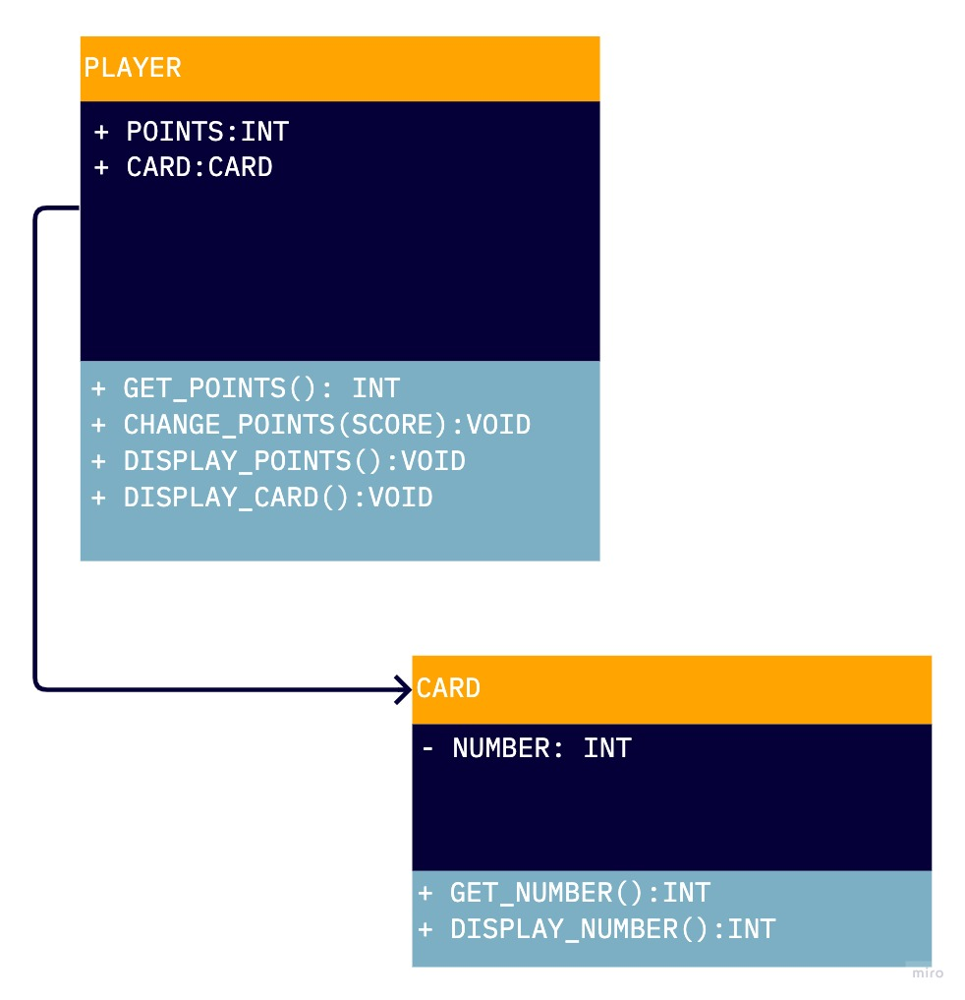

# Hilo

Hilo is a game in which the player guesses if the next card drawn by the dealer will be higher or lower than the previous one. Points are won or lost based on whether or not the player guessed correctly.

## Game requirements

---

Hilo is played according to the following rules.

The player starts the game with 300 points. Individual cards are represented as a number from 1 to 13. The current card is displayed. The player guesses if the next one will be higher or lower. The the next card is displayed. The player earns 100 points if they guessed correctly. The player loses 75 points if they guessed incorrectly. If a player reaches 0 points the game is over. If a player has more than 0 points they decide if they want to keep playing. If a player decides not to play again the game is over.

## Getting Started

---

Make sure you have Python 3.8.0 or newer installed and running on your machine. Open a terminal and
browse to the project's root folder. Start the program by running the following command.

```
python3 hilo
```

You can also run the program from an IDE like Visual Studio Code. Start your IDE and open the
project folder. Select the main module inside the dice folder and click the "run" button.

## Project Structure

---

The project files and folders are organized as follows:

```
root                    (project root folder)
+-- hilo                (source code for game)
  +-- game              (specific classes)
  +-- __main__.py       (program entry point)
+-- README.md           (general info)
```

## Required Technologies

---
- Python 3.8.0

## UML Diagram

---


## Define of classes:

---

Player

responsibilities: start points int (when game beggin start with 300) 
responsibilities: total points int (total point of the game until player decide to not play again or is equal to 0)

behaviors: earn points (if gussed corectly + 100 and ask play again. Y == display random card, N == game over) 
behaviors: lose points (if guessed incorrectly - 75, and if total point is = 0 game over) 
behaviors: play again (ask player if he want to play again)

Cards

responsibilities: number of cards int (ramdom card from 1 to 13) 
behaviors: display ramdom card (show random card from 1 to 13)

## Authors

---
- Diego Feresin (diegoferesin@gmail.com) - UML Diagrams and github adminitrator
- Emma Lund (lun21010@byui.edu) - create the Class and the methods for each class
- Nestor Rivera (riv21007@byui.edu) - Responsabilities and behaviors for each class
- Juan Castellani (cas22009@byui.edu) - main file to run the game and verify the classes functionability
- Kennette Guevara (rod21023@byui.edu) - visually apealing enhancements, validate inputs